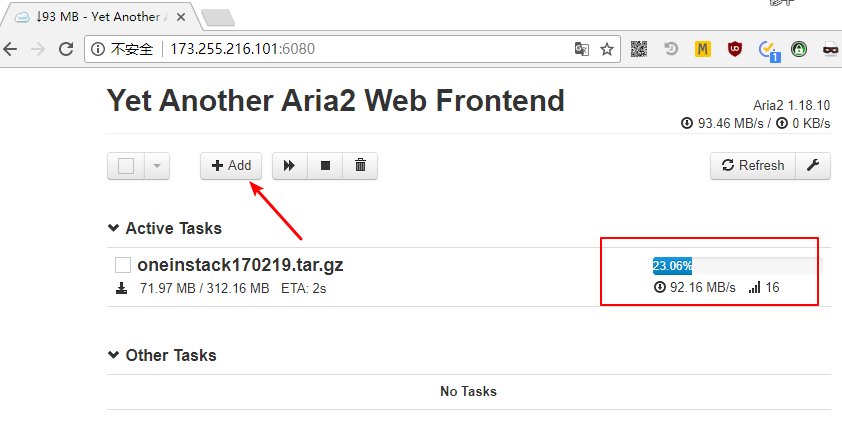
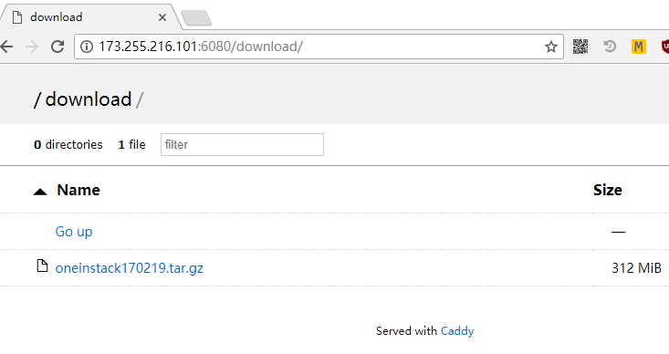

# aria2
Linux一键安装Aria2 + yaaw + Caddy Server实现离线下载

### 环境要求
* 推荐CentOS 7，理论上CentOS 6也可以。
* 后期支持Debian/Ubuntu

### 开始安装

直接复制下面的命令，一行一个，根据提示完成操作即可。

```
yum -y install wget unzip
wget https://github.com/helloxz/aria2/archive/master.zip
unzip master.zip && cd aria2-master && chmod u+x *.sh && ./install_aria2.sh
```

详细使用说明： [https://www.xiaoz.me/archives/9694](https://www.xiaoz.me/archives/9694)


### 部分截图



### 联系我

* Blog:[https://www.xiaoz.me/](https://www.xiaoz.me/) 
* Q Q:337003006